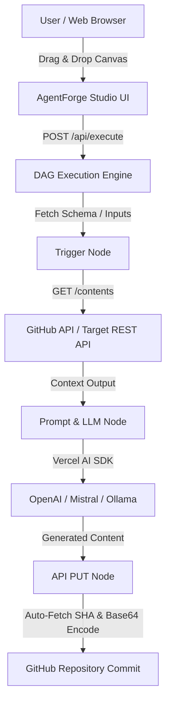

# AgentForge Studio 🚀

> **Visual IDE and Node-Based Execution Engine for Autonomous AI Agents**

AgentForge Studio is a cutting-edge, open-source platform designed to visually construct, simulate, and deploy complex multi-node AI workflows and autonomous agents with zero friction. Built with **Next.js 16**, **React Flow**, and the **Vercel AI SDK**, AgentForge provides an intuitive drag-and-drop canvas for linking triggers, prompts, LLMs, custom JavaScript nodes, and external REST APIs into seamless execution DAGs.

[](https://nextjs.org/)
[](https://react.dev/)
[](https://www.typescriptlang.org/)
[](https://tailwindcss.com/)
[](https://zustand-demo.pmnd.rs/)
[](https://opensource.org/licenses/MIT)

---

## 🌟 Project Overview

Designing production-ready AI pipelines usually requires stitching together disparate API endpoints, parsing nested JSON responses, and writing tedious boilerplate. AgentForge Studio solves this by giving developers an interactive node-based canvas:

- **Visual Workflow Builder**: Interactively drop and connect Trigger, Prompt, LLM, API, Code, and JSON nodes.
- **Multi-Model Support**: Native integration with **OpenAI** (`gpt-4o`), **Mistral** (`mistral-large-latest`), and local **Ollama** models (`llama3.2`).
- **Dynamic Variable Interpolation**: Pass outputs seamlessly between nodes using Mustache-style templates (`{{trigger.input}}`, `{{llm.output}}`, `{{output.base64}}`).
- **Automated GitHub API Integration**: Auto-fetches file SHAs and handles Base64 encoding for direct GitHub commits.
- **Export & Portability**: Export your agent flows as JSON configuration or standalone Node.js execution scripts.

---

## ✨ Key Features

### 🎨 Drag-and-Drop Canvas & Visual Execution
- Interactive React Flow canvas with custom styled nodes.
- Real-time execution status tracking with subtle glowing node states and flowing animated data edge paths.
- Resizable split-pane Monaco code editor and execution console.

### 🤖 Multi-Model AI Engine
- **OpenAI Integration**: Harness GPT-4o and GPT-4o-mini for high-reasoning tasks.
- **Mistral Integration**: Fast, high-accuracy completion via Mistral Large & Mixtral.
- **Local Ollama Support**: Run private workflows 100% offline using local open-weight LLMs.

### 🔌 Powerful Data Processing & API Automation
- **API Request Nodes**: Perform GET, POST, PUT, DELETE requests with header and body variable interpolation.
- **Custom Code Nodes**: Execute JavaScript snippets directly within the execution chain to clean or transform data.
- **JSON Extractor Nodes**: Target specific fields from API responses using dot-notation paths.

---

## 🏗️ System Architecture



---

## 📁 Project Structure

```bash
agentforge-studio/
├── src/
│   ├── app/
│   │   ├── api/
│   │   │   └── execute/        # Serverless DAG execution engine route handler
│   │   ├── globals.css         # Tailwind v4 styles & micro-animations
│   │   ├── layout.tsx          # Root layout & providers
│   │   └── page.tsx            # Main Studio workspace interface
│   ├── components/
│   │   ├── flow-builder.tsx    # React Flow canvas component
│   │   ├── node-properties.tsx # Side panel for editing node data & prompts
│   │   └── nodes/              # Custom node UI components (Trigger, API, LLM, etc.)
│   └── store/
│       └── flow-store.ts       # Zustand state management for nodes & edges
├── public/                     # Static assets
└── package.json                # Project dependencies and scripts
```

---

## 🚀 Getting Started

### Prerequisites

- **Node.js**: v18.0.0 or higher
- **npm** or **pnpm**

### Installation

1. Clone the repository:
   ```bash
   git clone https://github.com/auysh8/agentforge-studio.git
   cd agentforge-studio
   ```

2. Install dependencies:
   ```bash
   npm install
   ```

3. Set up environment variables:
   Create a `.env.local` file in the root directory:
   ```env
   OPENAI_API_KEY=your_openai_api_key
   MISTRAL_API_KEY=your_mistral_api_key
   ```

4. Run the development server:
   ```bash
   npm run dev
   ```

5. Open [http://localhost:3000](http://localhost:3000) in your browser.

---

## 🛠️ Available Scripts

- `npm run dev` - Launches the Next.js development server with Fast Refresh.
- `npm run build` - Compiles the TypeScript code and builds the production bundle.
- `npm run start` - Starts the production server.
- `npm run lint` - Runs ESLint code quality checks.

---

## 🤝 Contributing

Contributions are welcome! Feel free to open an issue or submit a pull request:

1. Fork the Project
2. Create your Feature Branch (`git checkout -b feature/AmazingFeature`)
3. Commit your Changes (`git commit -m "feat: Add AmazingFeature"`)
4. Push to the Branch (`git push origin feature/AmazingFeature`)
5. Open a Pull Request

---

## 📜 License

Distributed under the **MIT License**. See `LICENSE` for more information.

---

## 👨‍💻 Author

**Pankaj Bhandari**  
*Full-Stack & AI Agent Developer*

- **GitHub**: [@auysh8](https://github.com/auysh8)
- **LinkedIn**: [pankajbhandari2004](https://linkedin.com/in/pankajbhandari2004)
- **Email**: [pankajbhandari0714@gmail.com](mailto:pankajbhandari0714@gmail.com)
