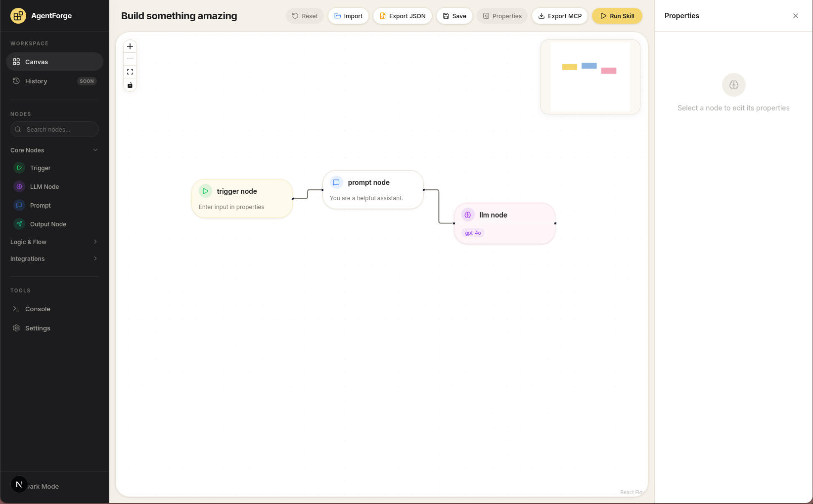

# AgentForge Studio 🛠️

> **A visual workflow builder and execution environment for designing, testing, and deploying AI agent orchestration pipelines.**

[](https://github.com/auysh8/agentforge-studio/stargazers)
[](LICENSE)


---

### ⭐️ **If you find AgentForge Studio useful, please give us a star on GitHub! It helps the project grow.** ⭐️

---

## 📸 Visual Preview



---

## ✨ Features

- 🎨 **Visual Flow Builder**: Interactive drag-and-drop node canvas powered by `@xyflow/react`.
- 🤖 **Multi-Provider LLM Nodes**: Native support for OpenAI, Mistral, Google Gemini, and local Ollama models.
- 🔀 **Conditional Branching**: Smart decision trees with condition logic evaluation nodes.
- 🌐 **External API Nodes**: Integrate third-party HTTP endpoints directly into execution graphs.
- 💻 **Real-Time Console Panel**: Inspect step execution, output streams, and debug logs live.
- 📦 **Modular Workflow Export**: Instantly export flow configurations to JSON or runtime SDK code.

---

## 🏗️ Architecture & Stack

AgentForge Studio combines Next.js App Router for serverless execution with React Flow and Zustand for reactive visual node graphs:

```
agentforge-studio/
├── src/
│   ├── app/
│   │   ├── api/execute/    # Serverless execution pipeline endpoint
│   │   └── page.tsx        # Main Studio workspace dashboard
│   ├── components/
│   │   ├── nodes/          # Custom node visual components (LLM, API, Condition)
│   │   ├── flow-builder.tsx# React Flow canvas wrapper
│   │   └── console-panel.tsx# Live execution output log viewer
│   └── store/
│       └── flow-store.ts   # Zustand state manager for node states & execution
```

---

## 🚀 Quick Start

### Prerequisites

- **Node.js**: `v18.x` or higher
- **npm**: `v9.x` or higher

### Local Setup

1. **Clone the repository:**
   ```bash
   git clone https://github.com/auysh8/agentforge-studio.git
   cd agentforge-studio
   ```

2. **Install dependencies:**
   ```bash
   npm install
   ```

3. **Start the dev server:**
   ```bash
   npm run dev
   ```

4. **Open in Browser:**
   Navigate to [http://localhost:3000](http://localhost:3000).

---

## 🤝 Contributing

Contributions of all sizes are welcome! Check out our [Contributing Guide](CONTRIBUTING.md) to get started.

- 🐛 **Found a bug?** Open a [Bug Report](https://github.com/auysh8/agentforge-studio/issues/new?template=bug_report.md)
- 💡 **Have a feature idea?** Submit a [Feature Request](https://github.com/auysh8/agentforge-studio/issues/new?template=feature_request.md)

---

## 📄 License

Distributed under the [MIT License](LICENSE).
