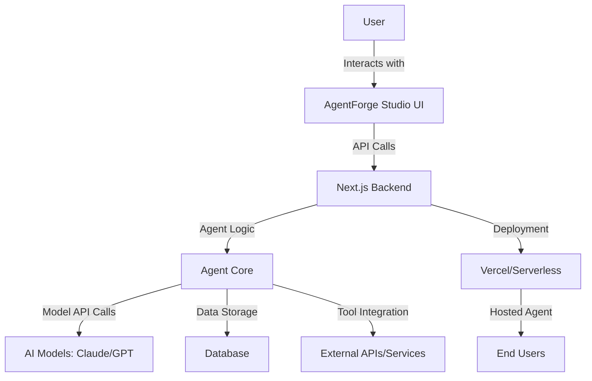

```markdown
# AgentForge Studio 🚀

**Build, Test, and Deploy AI Agents with Ease**

AgentForge Studio is a cutting-edge platform for designing, testing, and deploying autonomous AI agents. Whether you're a developer, researcher, or AI enthusiast, this tool simplifies agent creation with an intuitive interface, real-time collaboration, and seamless integration with leading AI models.

[](https://nextjs.org/)
[](https://www.typescriptlang.org/)
[](https://tailwindcss.com/)
[](https://ui.shadcn.com/)
[](https://vercel.com/)
[](https://opensource.org/licenses/MIT)

---

## 🌟 Project Overview

AgentForge Studio addresses the complexity of building autonomous AI agents by providing:

- **Visual Agent Builder**: Drag-and-drop interface for designing agent workflows.
- **Multi-Model Support**: Seamlessly switch between AI models (Claude, GPT, etc.).
- **Real-Time Testing**: Instant feedback with built-in simulation environments.
- **Collaboration Tools**: Share and iterate on agent designs with your team.
- **Deployment Ready**: Export agents as APIs or integrate directly into your applications.

Perfect for prototyping AI-driven solutions, educational purposes, or production-ready agent deployment.

---

## ✨ Key Features

<details>
<summary><b>🔧 Agent Design & Customization</b></summary>

- **Modular Architecture**: Build agents using reusable components.
- **Prompt Engineering**: Fine-tune agent behavior with advanced prompt templates.
- **Memory Management**: Configure short-term and long-term memory for context-aware agents.
- **Tool Integration**: Connect agents to APIs, databases, and external services.

</details>

<details>
<summary><b>🤖 Multi-Model AI Support</b></summary>

- **Claude Integration**: Leverage Anthropic's Claude models for advanced reasoning.
- **OpenAI Compatibility**: Support for GPT-3.5, GPT-4, and future models.
- **Local Models**: Run agents offline with Ollama or other local LLMs.

</details>

<details>
<summary><b>🚀 Deployment & Scalability</b></summary>

- **One-Click Deployment**: Deploy agents as serverless functions or microservices.
- **API Export**: Generate RESTful APIs for your agents.
- **Webhook Support**: Trigger agents via HTTP requests.
- **Scalable Infrastructure**: Built on Vercel for global low-latency access.

</details>

<details>
<summary><b>📊 Monitoring & Analytics</b></summary>

- **Real-Time Logs**: Track agent interactions and decisions.
- **Performance Metrics**: Monitor response times, token usage, and success rates.
- **Error Tracking**: Identify and debug issues with detailed error reports.

</details>

<details>
<summary><b>🤝 Collaboration & Sharing</b></summary>

- **Team Workspaces**: Collaborate on agent designs in real-time.
- **Version Control**: Track changes and roll back to previous versions.
- **Export/Import**: Share agent configurations as JSON files.

</details>

---

## 🏗️ Architecture Diagram



---

## 📁 Project Structure

```bash
agentforge-studio/
├── .github/                # GitHub workflows and issue templates
├── public/                 # Static assets
│   ├── favicon.ico
│   ├── images/             # Project screenshots and logos
│   └── robots.txt
├── src/
│   ├── app/                # Next.js app router
│   │   ├── (auth)/         # Authentication routes
│   │   ├── (main)/         # Main application routes
│   │   ├── api/            # API endpoints
│   │   ├── layout.tsx      # Root layout
│   │   └── page.tsx        # Home page
│   ├── components/         # Reusable UI components
│   │   ├── agents/         # Agent-specific components
│   │   ├── ui/             # ShadCN UI components
│   │   └── shared/         # Shared components
│   ├── config/             # Configuration files
│   ├── hooks/              # Custom React hooks
│   ├── lib/                # Utility functions and libraries
│   │   ├── agents/         # Agent core logic
│   │   ├── models/         # AI model integrations
│   │   └── utils/          # Helper functions
│   ├── styles/             # Global styles and Tailwind config
│   └── types/              # TypeScript type definitions
├── .env.local.example      # Environment variable template
├── .eslintrc.json          # ESLint configuration
├── .gitignore              # Git ignore rules
├── AGENTS.md               # Agent configuration guide
├── CLAUDE.md               # Claude integration guide
├── next.config.ts          # Next.js configuration
├── package.json            # Project dependencies and scripts
├── postcss.config.mjs      # PostCSS configuration
├── README.md               # Project documentation
└── tsconfig.json           # TypeScript configuration
```

---

## 🚀 Getting Started

### Prerequisites

- **Node.js** (v18 or later)
- **npm** or **yarn** or **pnpm**
- **Git**
- **API Keys** (for AI models):
  - [Anthropic Claude](https://www.anthropic.com/)
  - [OpenAI](https://openai.com/) (optional)

### Installation

1. **Clone the repository**:
   ```bash
   git clone https://github.com/auysh8/agentforge-studio.git
   cd agentforge-studio
   ```

2. **Install dependencies**:
   ```bash
   npm install
   # or
   yarn install
   # or
   pnpm install
   ```

3. **Set up environment variables**:
   - Copy `.env.local.example` to `.env.local`:
     ```bash
     cp .env.local.example .env.local
     ```
   - Update `.env.local` with your API keys:
     ```env
     NEXT_PUBLIC_CLUDE_API_KEY=your_claude_api_key
     NEXT_PUBLIC_OPENAI_API_KEY=your_openai_api_key
     NEXT_PUBLIC_APP_URL=http://localhost:3000
     ```

### Available Scripts

| Script | Description |
|--------|-------------|
| `npm run dev` | Start the development server |
| `npm run build` | Build the application for production |
| `npm start` | Start the production server |
| `npm run lint` | Run ESLint for code quality checks |
| `npm run format` | Format code using Prettier |

### Running the Project

1. **Start the development server**:
   ```bash
   npm run dev
   ```

2. **Open your browser**:
   Visit [http://localhost:3000](http://localhost:3000) to access AgentForge Studio.

---

## 🛠️ Usage

### Creating Your First Agent

1. **Navigate to the Agent Builder**:
   - Click on "New Agent" in the dashboard.

2. **Configure Agent Settings**:
   - **Name**: Give your agent a unique identifier.
   - **Description**: Briefly describe the agent's purpose.
   - **Model**: Select the AI model (Claude, GPT, etc.).
   - **Memory**: Configure short-term and long-term memory settings.

3. **Design Agent Workflow**:
   - Use the drag-and-drop interface to add and connect components.
   - Define prompts, tools, and decision logic.

4. **Test Your Agent**:
   - Use the built-in chat interface to interact with your agent.
   - Monitor logs and performance metrics in real-time.

5. **Deploy Your Agent**:
   - Click "Deploy" to generate an API endpoint.
   - Integrate the agent into your application using the provided API key.

### Example: Simple Chat Agent

```typescript
// Example API call to your deployed agent
const response = await fetch('https://your-agentforge-url/api/agents/chat', {
  method: 'POST',
  headers: {
    'Content-Type': 'application/json',
    'Authorization': `Bearer YOUR_API_KEY`
  },
  body: JSON.stringify({
    message: "Hello, how can you help me today?",
    sessionId: "unique-session-id"
  })
});

const data = await response.json();
console.log(data.response);
```

---

## 🛠️ Tech Stack

| Category | Technologies |
|----------|--------------|
| **Frontend** | Next.js, React, TypeScript, Tailwind CSS, ShadCN UI |
| **Backend** | Next.js API Routes, Serverless Functions |
| **AI Models** | Claude (Anthropic), OpenAI GPT |
| **Database** | (Optional) Supabase, Firebase, or custom backend |
| **Deployment** | Vercel, Netlify, or Node.js server |
| **Dev Tools** | ESLint, Prettier, Husky, GitHub Actions |

---

## 🤝 Contributing

We welcome contributions from the community! Here's how you can help:

1. **Fork the repository** and create your branch from `main`.
2. **Set up the project** locally (see [Getting Started](#-getting-started)).
3. **Make your changes** and ensure they follow the project's coding standards.
4. **Test your changes** thoroughly.
5. **Submit a pull request** with a clear description of your changes.

### Contribution Guidelines

- **Code Style**: Follow the existing code style and conventions.
- **Commit Messages**: Use [Conventional Commits](https://www.conventionalcommits.org/).
- **Documentation**: Update the README or relevant documentation if needed.
- **Testing**: Add tests for new features or bug fixes.

### Reporting Issues

- Use the [GitHub Issues](https://github.com/auysh8/agentforge-studio/issues) page to report bugs or request features.
- Provide as much detail as possible, including steps to reproduce the issue.

---

## 📜 License

This project is licensed under the **MIT License**. See the [LICENSE](LICENSE) file for details.

---

## 👨‍💻 Author

**Pankaj Bhandari**

- **GitHub**: [https://github.com/auysh8](https://github.com/auysh8)
- **LinkedIn**: [https://linkedin.com/in/pankajbhandari2004](https://linkedin.com/in/pankajbhandari2004)
- **Email**: [pankajbhandari0714@gmail.com](mailto:pankajbhandari0714@gmail.com)

---

**Star ⭐ this repository if you find it useful!**
**Fork 🍴 and contribute to make AgentForge Studio even better!**
```